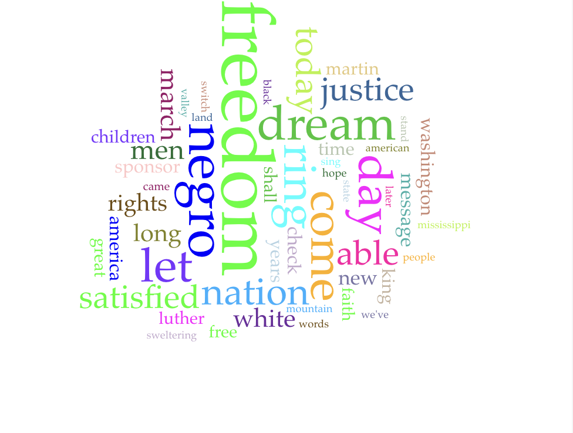

# Distant Reading Assignment 

I used Voyant to search this website [MLK Speech~](https://www.npr.org/2010/01/18/122701268/i-have-a-dream-speech-in-its-entirety)

By using Voyant to analyze Martin Luther King Jr.’s “I Have a Dream,” speech, I was able to notice the frequent use of vocabulary such as words including “freedom,” “justice,” and “dream.” This confirmed the major themes of the text, but the visualization could not justify the emotional power or historical context behind these simple terms. When asking CoPilot to analyze the same speech, it was able to explain the rhetorical strategies such as repetition, parallelism, and how it appeals to pathos, which Voyant’s numbers and word frequencies alone could not reveal. These tools together taught me that distant reading is helpful for understanding large scale patterns, but it is not helpful to capture nuance, tone, or context without the human interpretation aspects. This process was able to show me how digital tools can highlight surface level trends in a text, but lack the meaningful analysis that is required for critical thinking from a researcher. 

Check out my image

 

---

I also used Copilot with ChatGPT-5 here is some of our conversation: 
Me: What rhetorical devices does MLK use in the “I Have a Dream” speech?

CoPilotLinks: Martin Luther King Jr. uses repetition, metaphor, and allusion. The repeated phrase “I have a dream” reinforces his vision, while metaphors like “the manacles of segregation” evoke powerful imagery. He also alludes to the Declaration of Independence and the Bible.

Me: Can you tell me about the emotional tone of the speech?

CoPilotLinks: The tone is hopeful, urgent, and resolute. MLK balances the pain of injustice with a deep belief in the possibility of change, inspiring both empathy and action.

Me: Does the speech reference any historical documents?

CoPilotLinks: Yes, it references the Emancipation Proclamation, the Constitution, and the Declaration of Independence. These allusions frame civil rights as a fulfillment of America’s founding promises.

Me: What can’t you tell me about the speech?

CoPilotLinks: I can’t fully capture the emotional impact of MLK’s delivery or the audience’s reaction. I also can’t interpret cultural nuances or personal motivations beyond the text itself.

Me: Are your results accurate?

CoPilotLinks: They’re accurate for identifying rhetorical techniques and themes, but for deeper cultural or historical analysis, it’s best to consult scholarly sources or firsthand accounts.
